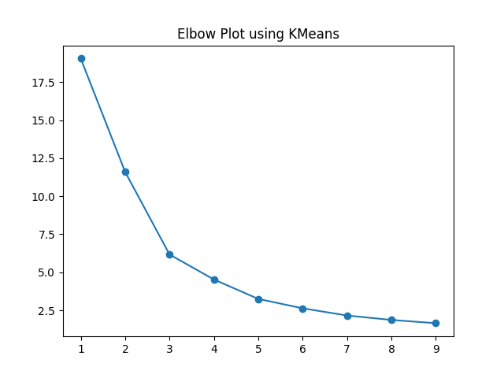
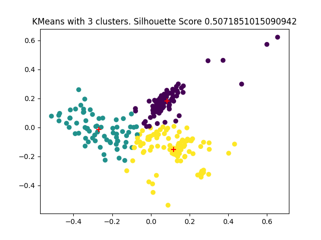

# Email Analysis with GMail API

### Steps to run 

1.) Build docker image

`docker build --target email_run -t email-analysis-dev:latest .`

2. ) Run docker image in container

`docker run -d email-analysis-dev`

or

`docker run email-analysis-dev`

### Results

- Out of 10 clusters, 3 is the most optimum for differentiating the data

- With around a .5 silohouette score, our clusters divide the points well 

#### How to improve project

- Apply KMeans on a dataset containing stratified sampling from Inbox, Sent, and Spam

- Apply a Keppler Mapper TDA tool to visualize data as a graph (nodes and edges)

- Write unit tests + Setup ci/cd workflow
